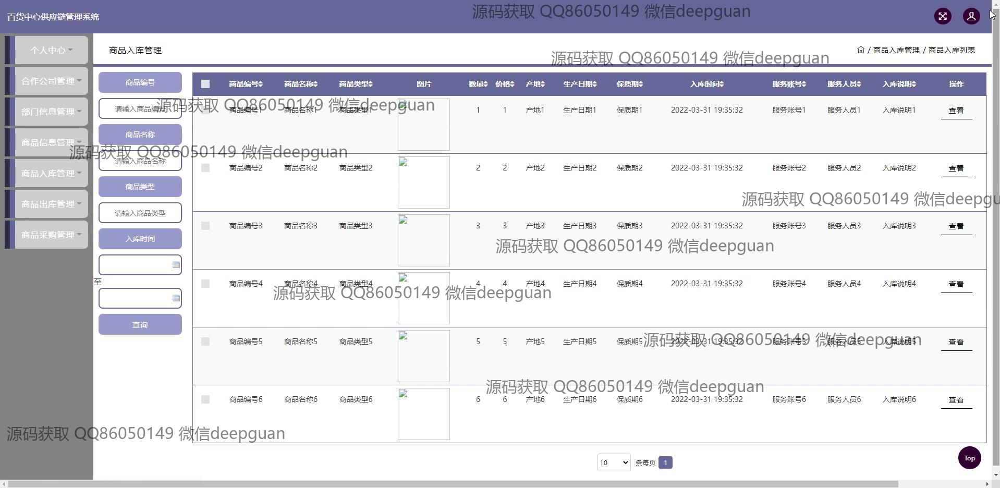

<h1 align="center">百货中心供应链管理系统+jsp</h1>

## 简介
百货中心供应链管理系统：支持角色权限管理，功能涵盖注册登录、商品信息管理、采购与销售管理、合作公司管理、部门信息管理、在线支付等模块，界面简洁高效。    --计算机毕业设计源码；毕设源码；java毕业设计源码

## 联系方式

<h3 align="center">获取完整代码与数据库文件 + 微信：deepguan QQ: 86050149 QQ群: 783742310</h3>

<h3 align="center">可帮忙远程部署 包运行成功！提供远程部署、修改代码、设计文档指导、代码讲解等服务！</h3>

## 功能介绍（完整见运行截图）
管理员：管理员可以注册和登录系统，管理个人信息并访问“个人中心”及多个管理模块，如财务管理、销售管理、商品入库管理、商品出库管理、合作公司管理等。还能进行信息录入、编辑与删除，包括商品信息、用户账户信息、部门信息和合作公司信息管理。管理员可通过筛选和查询功能高效管理数据，并使用在线支付功能，实现系统化管理与操作。

用户：用户通过注册登录后可访问个人中心，查看和修改个人信息。用户能够在系统内进行供应链相关的操作，如采购管理、销售管理和库存管理。用户可录入、编辑或查询商品详情，包括商品编号、类型、价格和保质期等信息。同时，用户能够通过合作公司管理和部门信息管理模块与其他角色协作完成供应链全流程管理。

## 运行截图

本代码来源于网络,仅供学习参考使用!

